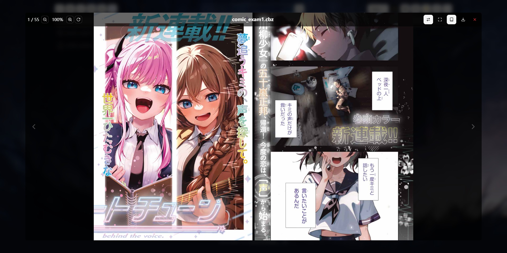
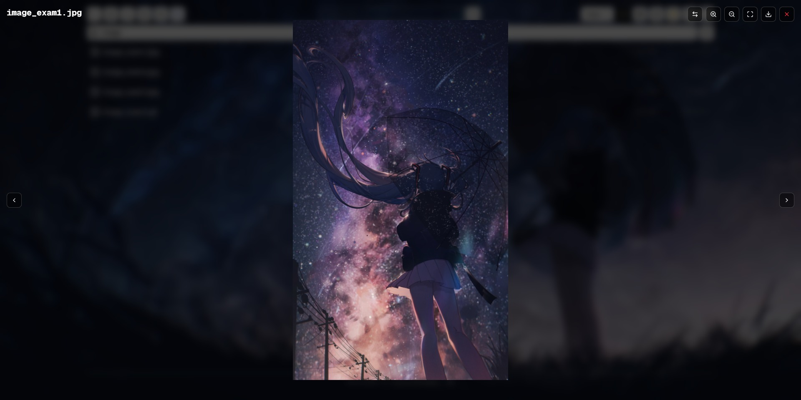

# SimpleFileServer

```txt
 /$$$$$$ /$$                      /$$                /$$$$$$$$/$$/$$                 /$$$$$$                                              
 /$$__  $|__/                     | $$               | $$_____|__| $$                /$$__  $$                                             
| $$  \__//$$/$$$$$$/$$$$  /$$$$$$| $$ /$$$$$$       | $$      /$| $$ /$$$$$$       | $$  \__/ /$$$$$$  /$$$$$$ /$$    /$$/$$$$$$  /$$$$$$ 
|  $$$$$$| $| $$_  $$_  $$/$$__  $| $$/$$__  $$      | $$$$$  | $| $$/$$__  $$      |  $$$$$$ /$$__  $$/$$__  $|  $$  /$$/$$__  $$/$$__  $$
 \____  $| $| $$ \ $$ \ $| $$  \ $| $| $$$$$$$$      | $$__/  | $| $| $$$$$$$$       \____  $| $$$$$$$| $$  \__/\  $$/$$| $$$$$$$| $$  \__/
 /$$  \ $| $| $$ | $$ | $| $$  | $| $| $$_____/      | $$     | $| $| $$_____/       /$$  \ $| $$_____| $$       \  $$$/| $$_____| $$      
|  $$$$$$| $| $$ | $$ | $| $$$$$$$| $|  $$$$$$$      | $$     | $| $|  $$$$$$$      |  $$$$$$|  $$$$$$| $$        \  $/ |  $$$$$$| $$      
 \______/|__|__/ |__/ |__| $$____/|__/\_______/      |__/     |__|__/\_______/       \______/ \_______|__/         \_/   \_______|__/      
                         | $$                                                                                                              
                         | $$                                                                                                              
                         |__/                                                                                                              
```

## Introduction

Simply put, this is a Node.js-based file server that allows you to quickly set up a file server on your host and provides a web interface for sharing and previewing files across multiple devices.

## Project Background

Personally, I prefer to keep my files, such as images, videos, and documents, on my own host. However, I can't carry my host everywhere, and I don't want to keep large file copies on my other devices. I needed a tool that would allow me to access my files through a browser on any device and quickly view my file contents, such as novels and comics. While cloud storage was my first thought, after losing my files due to a malfunction with a major cloud storage provider (which I won't name, but I can assure you it was a large enterprise, not some small provider) despite paying a significant fee, I lost faith in cloud storage. Under these circumstances, along with some requirements from my research project at the time, I created this project.

## Example

- **Main Page**


- **Audio Preview**


- **Comic Preview**



- **Image Preview**



- **Novel Preview**


- **PDF Preview**


- **Text Preview**


- **Video Preview**


## Project Structure

The project is simply divided into three parts:

- `frontend`: The frontend part of the project, a web interface based on `next.js`
- `backend`: The server part of the project, a file server based on `express.js`
- `Indexer`: A C# program for quickly building file indexes, which works well on my Windows host but hasn't been tested on other platforms. Of course, the `backend` itself has basic file indexing functionality, though it might be slower.

## Installation Guide

### Required Environment

- Node.js (The version I used is v24.0.0, and the npm version is 11.3.0.)

### Optional Environment

- .NET 8.0 SDK (if using C# indexer)
- ImageMagick (if using ImageMagick for PSD file processing)

### Installation Steps

1. Clone the project

```bash
git clone https://github.com/Kobayashi2003/SimpleFileServer.git
cd SimpleFileServer
```

2. Install backend dependencies

```bash
cd SimpleFileServer/backend
npm install
```

3. Install frontend dependencies

```bash
cd SimpleFileServer/frontend
npm install
```

4. Compile C# indexer (optional)

```bash
cd SimpleFileServer/Indexer
./build.ps1
```

5. Start the backend

```bash
cd SimpleFileServer/backend
npm start
```

6. Start the frontend

```bash
cd SimpleFileServer/frontend
npm run build
npm start
```

7. Access the frontend

Visit `http://localhost:2711` (default port) to use the file server.

## Configuration

### Backend Configuration

The backend default configuration file is located at `backend/config.js`. You can override the default configuration through environment variables or by creating a `.env` file.

#### Basic Configuration

| Configuration Item | Environment Variable | Default Value | Description |
|-------------------|---------------------|---------------|-------------|
| Port Number | PORT | 11073 | Server listening port |
| Base Directory | BASE_DIRECTORY | example | Base directory for file server, where all files are stored |
| Temporary Directory | TMP_DIRECTORY | {system temp}/simple-file-server | Directory for storing temporary files |
| Parallel File Processing | PARALLEL_FILE_PROCESSING | true | Enable parallel file processing for better performance |
| Upload Count Limit | UPLOAD_COUNT_LIMIT | 10 | Maximum number of files per upload |
| Upload Size Limit | UPLOAD_SIZE_LIMIT | 100GB | Maximum file size per upload |
| Content Display Limit | CONTENT_MAX_SIZE | 5GB | Maximum file size for direct content display |

#### Logging Configuration

| Configuration Item | Environment Variable | Default Value | Description |
|-------------------|---------------------|---------------|-------------|
| Log Directory | LOG_DIRECTORY | logs | Directory for storing log files |
| Console Timestamps | ENABLE_CONSOLE_TIMESTAMPS | true | Enable timestamps in console output |
| Error Logging | ENABLE_ERROR_LOGGING | true | Enable error logging to files |
| API Logging | ENABLE_API_LOGGING | true | Enable API call logging |
| File Logging | ENABLE_FILE_LOGGING | false | Enable saving logs to files |
| API Log Level | API_LOG_LEVEL | detailed | Options: basic, detailed, verbose |
| Log Request Body | LOG_REQUEST_BODY | true | Enable request body logging |
| Log Response Body | LOG_RESPONSE_BODY | false | Enable response body logging |
| Log File Rotation | LOG_FILE_ROTATION | daily | Options: daily, weekly, monthly, none |
| Max Log File Size | MAX_LOG_FILE_SIZE | 10 | Maximum log file size in MB |
| Log Files to Keep | LOG_FILES_TO_KEEP | 7 | Number of log files to retain |

#### Image Processing Configuration

| Configuration Item | Environment Variable | Default Value | Description |
|-------------------|---------------------|---------------|-------------|
| Generate Thumbnail | GENERATE_THUMBNAIL | false | Enable thumbnail generation |
| Generate GIF Thumbnail | GENERATE_THUMBNAIL_FOR_GIF | false | Enable thumbnail generation for GIF files |
| Thumbnail Cache Directory | THUMBNAIL_CACHE_DIR | {temp}/thumbnails | Directory for storing thumbnails |
| Background Image Path | BACKGROUND_IMAGE_PATH | bg.jpg | Path to background image |
| Background Images Directory | BACKGROUND_IMAGES_DIR | backgrounds | Directory for background images |
| Process PSD | PROCESS_PSD | false | Enable PSD to PNG conversion |
| PSD Cache Directory | PSD_CACHE_DIR | {temp}/processed-psd | Directory for processed PSD files |
| PSD Processor | PSD_PROCESSOR | psd | Options: psd (JavaScript) or imagemagick |

#### User Authentication Configuration

| Configuration Item | Environment Variable | Default Value | Description |
|-------------------|---------------------|---------------|-------------|
| User Rules | USER_RULES | [] | Format: username\|password\|rw, rw=read-write, r=read-only |

#### File Type Detection Configuration

| Configuration Item | Environment Variable | Default Value | Description |
|-------------------|---------------------|---------------|-------------|
| MIME Magic | USE_MIME_MAGIC | false | Enable mime-magic library for file type detection |
| Custom Content Types | CUSTOM_CONTENT_TYPES | {} | Custom file extension to MIME type mapping |

#### File Indexing Configuration

| Configuration Item | Environment Variable | Default Value | Description |
|-------------------|---------------------|---------------|-------------|
| File Index Path | FILE_INDEX_PATH | {temp}/{hash}.db | SQLite database file path |
| Use Index for Files API | USE_FILE_INDEX_FOR_FILES_API | false | Use file index for /api/files endpoint |
| Enable File Index | USE_FILE_INDEX | false | Enable file indexing functionality |
| Update Index on Write | UPDATE_INDEX_ON_WRITE | false | Update index during write operations |
| Rebuild Index on Startup | REBUILD_INDEX_ON_STARTUP | false | Rebuild index when server starts |
| Count Files Batch Size | COUNT_FILES_BATCH_SIZE | 100 | Batch size for counting files |
| Index Batch Size | INDEX_BATCH_SIZE | 100 | Batch size for building index |
| Indexer Search Algorithm | INDEXER_SEARCH_ALGORITHM | bfs | Options: bfs or dfs |
| Concurrent Indexing | INDEXER_CONCURRENCY_ENABLED | true | Enable concurrent file processing |
| Concurrency Limit | INDEXER_CONCURRENCY_LIMIT | 100 | Maximum concurrent file operations |
| Index Storage Mode | INDEXER_STORAGE_MODE | batch | Options: batch or immediate |
| Indexer Worker Count | INDEXER_WORKER_COUNT | 0 | 0=auto, or specify count |

#### C# Indexer Configuration

| Configuration Item | Environment Variable | Default Value | Description |
|-------------------|---------------------|---------------|-------------|
| Use C# Indexer | USE_CSHARP_INDEXER | false | Use C# indexer instead of Node.js indexer |
| C# Indexer Path | CSHARP_INDEXER_PATH | ../Indexer/bin/Release/net8.0/NtfsIndexer.exe | Path to C# indexer executable |
| Force Rebuild Index | CSHARP_INDEXER_FORCE_REBUILD | false | Force rebuild index on startup |
| Auto Restart | CSHARP_INDEXER_AUTO_RESTART | true | Auto restart on crash |
| Max Restarts | CSHARP_INDEXER_MAX_RESTARTS | 3 | Maximum restart attempts |
| Restart Delay | CSHARP_INDEXER_RESTART_DELAY | 5 | Delay before restart in seconds |

#### File Watcher Configuration

| Configuration Item | Environment Variable | Default Value | Description |
|-------------------|---------------------|---------------|-------------|
| Enable File Watcher | USE_FILE_WATCHER | false | Enable real-time file system monitoring |
| Watch Depth | WATCH_DEPTH | 1 | Directory watch depth: 0=base only, -1=all subdirectories |
| Ignore Patterns | WATCH_IGNORE_PATTERNS | /.git/,/node_modules/,/_pycache_/ | Patterns to ignore |
| Debounce Interval | WATCH_DEBOUNCE_INTERVAL | 1000 | Event debounce interval in ms |
| Max Retries | WATCH_MAX_RETRIES | 3 | Maximum retry attempts |
| Retry Delay | WATCH_RETRY_DELAY | 10000 | Delay before retry in ms |

#### Recycle Bin Configuration

| Configuration Item | Environment Variable | Default Value | Description |
|-------------------|---------------------|---------------|-------------|
| Use Recycle Bin | USE_RECYCLE_BIN | false | Enable recycle bin functionality |
| Recycle Bin Directory | RECYCLE_BIN_DIRECTORY | {temp}/recycle-bin | Directory for storing deleted files |
| Recycle Bin Retention Days | RECYCLE_BIN_RETENTION_DAYS | 30 | Number of days to keep files in recycle bin |
| Recycle Bin Auto Cleanup | RECYCLE_BIN_AUTO_CLEANUP | true | Enable automatic cleanup of old files in recycle bin |
| Recycle Bin Max Size | RECYCLE_BIN_MAX_SIZE | 0 | Maximum size of recycle bin in MB |

### Frontend Configuration

The frontend configuration file is located at `frontend/next.config.ts`, mainly for configuring API proxy. You can override the default configuration through environment variables or by creating a `.env.local` file.

#### API Proxy Configuration

| Configuration Item | Environment Variable | Default Value | Description |
|-------------------|---------------------|---------------|-------------|
| Backend Server URL | NEXT_PUBLIC_API_URL | http://localhost:11073 | Frontend will proxy all `/api/*` requests to this address |

### Environment Variables Example

Here's an example of my commonly used backend configuration:

```env
BASE_DIRECTORY=D:/Temp

GENERATE_THUMBNAIL=true
PROCESS_PSD=true

USER_RULES=kobayashi|kobayashi123|rw

USE_CSHARP_INDEXER=true
USE_MIME_MAGIC=true
```

## TODO

- [ ] **TODO**:~~实现Image Preivew中的焦点缩放~~
- [ ] **TODO**:~~让page中的双击功能只在合适的区域中点击才有效~~
- [ ] **TODO**:~~在PreviewBase中，添加对移动端浏览器下拉刷新的禁用功能~~
- [ ] **TODO**:~~实现对多根目录的支持~~
- [ ] **TODO**:实现文件的拖拽功能，用于拖动移动文件

- [ ] **TODO**:实现VideoOnly与AudioOnly模式

- [ ] **TODO**:实现对OFFICE文档的预览
- [ ] **TODO**:实现对URL的预览
- [ ] **TODO**:实现对压缩包文件的预览

- [ ] **TODO**:为C# indexer添加monitor的可关闭选项
- [ ] **TODO**:增加索引的方案，改为不含完整路径，只包含父子关系的结构

## BUG

- [ ] **BUG**:image view模式下，浏览器默认的图片拖动事件将会错误地触发文件拖拽上传功能
- [ ] **BUG**:在PDF preview中，若焦点被iframe获取，则无法响应键盘事件
